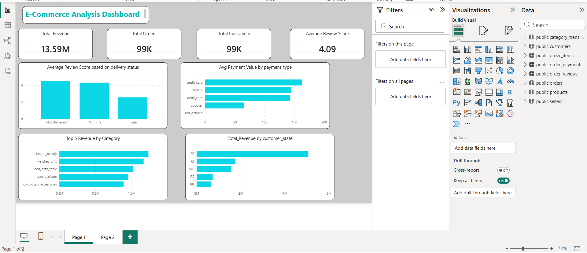
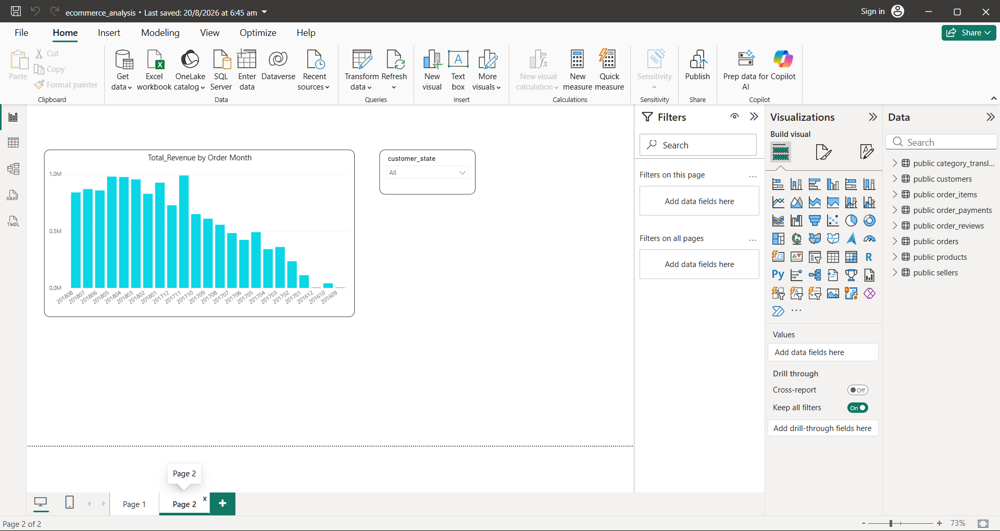

# E-Commerce Sales & Customer Experience Analysis

SQL + Power BI analysis of Olist's Brazilian e-commerce dataset — revenue trends, delivery performance, and customer payment behavior.

## Overview

This project analyzes ~100,000 orders from [Olist](https://www.kaggle.com/datasets/olistbr/brazilian-ecommerce), a Brazilian e-commerce marketplace, to answer four core business questions a retail analyst would typically be asked. Data was cleaned and modeled in PostgreSQL, then visualized in Power BI.

**Tools used:** PostgreSQL, pgAdmin, SQL, Power BI Desktop, DAX

## Business Questions

1. Which product categories generate the most revenue?
2. Does delivery delay affect customer review scores?
3. Which states generate the highest sales?
4. What is the average order value by payment type?

## Dashboard

**Page 1 — Sales, Delivery & Payment Overview**


**Page 2 — Revenue Trend Over Time**


## Key Insights

**1. Revenue is concentrated in a few categories.**
The top 5 categories — health & beauty, watches & gifts, bed/bath/table, sports & leisure, and computer accessories — account for a disproportionate share of total delivered revenue (₹13.2M). A classic Pareto pattern: a small number of categories drive most of the business.

| Category | Revenue |
|---|---|
| health_beauty | ₹1,233,131.72 |
| watches_gifts | ₹1,166,176.98 |
| bed_bath_table | ₹1,023,434.76 |
| sports_leisure | ₹954,852.55 |
| computers_accessories | ₹888,724.61 |

**2. Delivery reliability strongly predicts customer satisfaction.**
Orders delivered on time average a **4.30** review score, while late orders drop to **2.62**, and orders that were never delivered average just **1.73**. This is one of the strongest relationships in the dataset — delivery performance is a direct lever on customer experience, not just an operations metric.

| Delivery Status | Avg Review Score | Order Count |
|---|---|---|
| On Time | 4.30 | 33,495 |
| Late | 2.62 | 2,930 |
| Not Delivered | 1.73 | 1,073 |

**3. Sales are heavily concentrated in one state.**
São Paulo (SP) alone generates **₹5.07M** in delivered revenue — nearly 3x the next-highest state, Rio de Janeiro (₹1.76M). This reflects SP's role as Brazil's largest economic hub, but also signals geographic concentration risk.

| State | Revenue |
|---|---|
| SP | ₹5,067,633.16 |
| RJ | ₹1,759,651.13 |
| MG | ₹1,552,481.83 |
| RS | ₹728,897.47 |
| PR | ₹666,063.51 |

**4. Credit card is both the most-used and highest-value payment method.**
Average order value is highest for credit card (₹163.32), followed by boleto (₹145.03) and debit card (₹142.57). Voucher-based orders have the lowest average value (₹65.70).

| Payment Type | Avg Order Value |
|---|---|
| credit_card | ₹163.32 |
| boleto | ₹145.03 |
| debit_card | ₹142.57 |
| voucher | ₹65.70 |
| not_defined | ₹0.00 |

## Methodology Notes

- All revenue and sales figures are filtered to **delivered orders only**, since cancelled or undelivered orders don't represent completed sales.
- The delivery-status-vs-review-score analysis intentionally includes **all** orders regardless of delivery outcome, since comparing outcomes is the point of that analysis.
- Payment-type analysis is **not** filtered by delivery status, since payment occurs at checkout, independent of whether the order was ultimately delivered.
- Data was validated with row-count checks, duplicate checks, and orphan-record checks (`LEFT JOIN ... WHERE ... IS NULL`) across every table before analysis, after several source CSVs were found to have import/quoting corruption affecting `order_id` and `product_id` values.

## Repository Structure

```
ecommerce-analysis/
├── README.md
├── sql/
│   ├── 01_schema_and_data_checks.sql
│   └── 02_business_questions.sql
└── dashboard/
    ├── dashboard_page1.png
    └── dashboard_page2.png
```

## Data Source

[Brazilian E-Commerce Public Dataset by Olist](https://www.kaggle.com/datasets/olistbr/brazilian-ecommerce) — ~100,000 orders placed between 2016 and 2018 across multiple marketplaces in Brazil.
